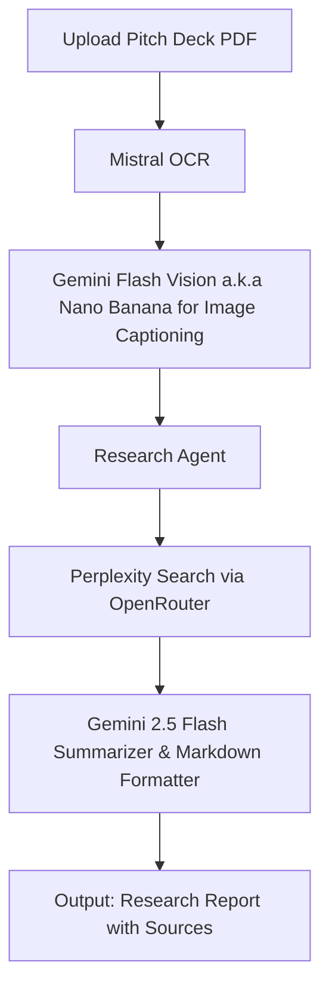

# Winning Pitch

**Winning Pitch** is an end-to-end research automation system that analyzes startup pitch decks using OCR, AI vision models, and intelligent web search. It automatically extracts data, enriches it with external research, and generates a structured Markdown report with citations, ready for investment or due-diligence review.

---

## Overview  

The project processes raw **pitch decks (PDFs)** using **Mistral OCR** and **Gemini Flash Vision (Nano Banana)**, performs web research via **Perplexity Search**, and produces a human-readable, cited summary.

It’s designed to help **investors, analysts, and accelerators** quickly evaluate startups based on their decks.

---

## Architecture  



---

## Technology Stack
|Component         | Technology                                |
|------------------|-------------------------------------------|
|Backend Framework | **FastAPI**                               |
|OCR Engine        | **Mistral OCR**                           |
|Image Captioning  | **Gemini 2.5 Flash Vision (Nano Banana)** |
|Web Search        | **Perplexity (via OpenRouter)**           |
|Language Model    | **Gemini 2.5 Flash (via OpenRouter)**     |
|Orchestration     | **Python + Async FastAPI Routes**         |
|Output Format     | **Markdown with Citations**               |

---

## Installation & Setup

### Backend

1. Clone the Repository
    ```bash
    git clone https://github.com/rkaushick-neu/winning-pitch.git
    cd winning-pitch/backend
    ```
2. Create a Virtual Environment

    On Mac
    ```bash
    python -m venv .venv
    source .venv/bin/activate
    ```
    On Windows:
    ```powershell
    python -m venv .venv
    .venv\Scripts\activate
    ```
3. Install Dependencies
    ```bash
    pip install -r requirements.txt
    ```
4. Configure Environment Variables:

    Copy the example environment file and fill in your keys:
    ```bash
    cp .env.example .env
    ```
    Then open `.env` and update the values as needed (e.g., API keys, database URLs).
5. Run the FastAPI Server
   ```bash
   uvicorn main:app --reload 
   ```
6. Navigate to Swagger UI to test the APIs:
   ```
   http://localhost:8000/docs
   ```

### Frontend

1. Navigate to the Frontend Folder from the Root Folder `winning-pitch/`
    ```bash
    cd frontend
    ```
2. Install Dependencies
    ```bash
    npm install
    ```
3. Configure Environment Variables:

    Copy the example environment file:
    ```bash
    cp .env.example .env
    ```

    Open .env and update the backend API base URL if needed:
    ```
    VITE_API_BASE=http://localhost:8000
    ```
4. Run the Development Server
    ```bash
    npm run dev
    ```

    The app should now be available at: `http://localhost:5173`
5. Build for Production
    ```bash
    npm run build
    ```
6. Preview the Production Build (Optional)
    ```bash
    npm run preview
    ```
---

## Future Improvements

- **Add Pitch Transcripts:**  
    Include transcripts from the founder’s presentation (not just the slides) to capture context, tone, and additional insights that might not appear in the visual deck.

- **Integrate Vector Database (Qdrant):**  
    Store embeddings for both slide deck text and web research results in a vector database like Qdrant.  
    - Enables future features such as *"Chat with the Pitch"* — allowing investors to query and explore the startup details conversationally.  
    - Include metadata for each chunk to indicate its source (e.g., pitch deck, website, or article).

- **Interactive Chat Interface:**
    Implementing the vector database would allow us to move from static Markdown output to a conversational UI.
    - Investors can ask follow-up questions like "What’s their competitive moat?" or "Compare this to X startup."

- **Evals for Prompts & Models:**  
  With prompt versioning already in place, introduce evaluation pipelines to compare prompt effectiveness across LLMs.  
  - Makes it easy to A/B test and optimize prompts for clarity, accuracy, and relevance.  
  - Helps select the most efficient model–prompt pair for each research task (web search and summarizer).
